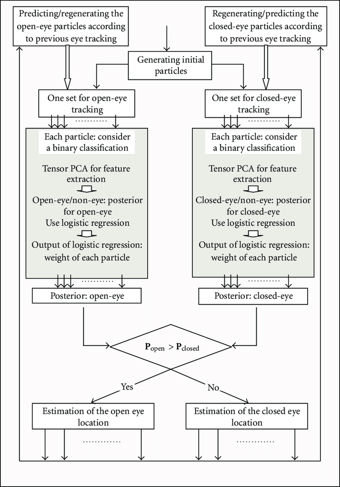
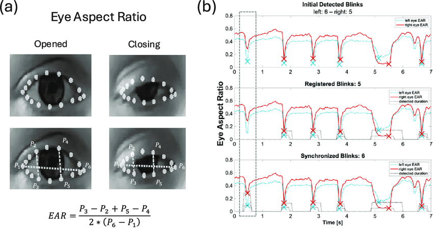
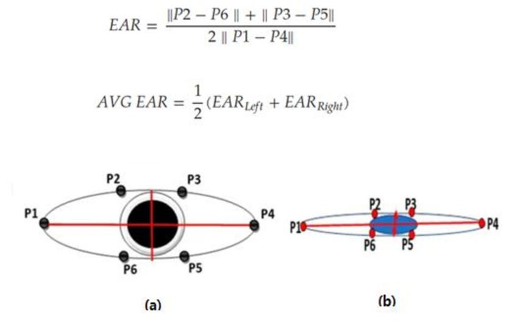

# Eye Blink & Fatigue Detection

> Sistem deteksi kedipan mata dan kelelahan berbasis **Eye Aspect Ratio (EAR)** menggunakan **Python** dan **MediaPipe Face Mesh**.

## Deskripsi

Proyek ini adalah sistem **pendeteksi kedipan mata (Eye Blink Detection)** dan **indikasi kelelahan (Fatigue Detection)** secara **real-time** menggunakan **Python**, **MediaPipe Face Mesh (468 landmark)**, dan pendekatan matematis **Eye Aspect Ratio (EAR)**.

Aplikasi ini memanfaatkan kamera untuk memonitor kondisi mata pengguna dan menampilkan informasi seperti jumlah kedipan, nilai EAR, blink rate, serta peringatan kelelahan.

---

## Fitur Utama

* ✔ Eye Blink Detection (Real-time)
* ✔ Blink Rate (kedipan per menit)
* ✔ EAR Graph (EAR vs waktu)
* ✔ Adaptive EAR Threshold
* ✔ Fatigue & Drowsiness Detection
* ✔ MediaPipe 468 Facial Landmarks
* ✔ Visualisasi landmark mata

---

## Preview & Visualisasi

### Diagram Sistem



### Contoh Grafik EAR vs Waktu



### Mekanisme pendeteksi



## Konsep Eye Aspect Ratio (EAR)

EAR adalah rasio geometris yang menggambarkan tingkat keterbukaan mata berdasarkan jarak antar landmark mata.

Rumus:

EAR = (||p2 − p6|| + ||p3 − p5||) / (2 × ||p1 − p4||)

Interpretasi:

* EAR tinggi → mata terbuka
* EAR rendah → mata tertutup (kedipan)

Jika EAR berada di bawah threshold selama beberapa frame berturut-turut, sistem menganggap terjadi satu kedipan.

---

## Blink Rate

Blink rate dihitung berdasarkan jumlah kedipan dalam interval waktu tertentu (kedipan/menit).

Indikasi:

* 10–20 blink/menit → normal
* > 25 blink/menit → indikasi kelelahan

---

## ⚙ Adaptive Threshold

Alih-alih menggunakan threshold statis, sistem dapat menyesuaikan nilai threshold EAR berdasarkan:

* EAR rata-rata pengguna
* Kondisi pencahayaan
* Variasi bentuk mata

Hal ini membuat sistem lebih robust dan personal.

---

## Fatigue Detection

Fatigue dideteksi menggunakan kombinasi:

* Blink rate tinggi
* Durasi mata tertutup yang lama
* EAR rendah secara konsisten

Contoh kondisi:

* Mata tertutup > 1.5 detik → **Drowsy Warning**
* Blink rate tinggi + EAR rendah → **Fatigue Detected**

---

## EAR vs Waktu

Nilai EAR direkam setiap frame dan dapat divisualisasikan sebagai grafik **EAR terhadap waktu**.

### Contoh Grafik EAR vs Waktu

(Ilustrasi)

```
EAR
│        ┌───┐        ┌───┐
│        │   │        │   │
│   ┌────┘   └────┐   └───┘
│───┘              └─────────── waktu
```

Penurunan EAR yang tajam menunjukkan **kedipan mata**. Jika EAR berada di bawah threshold dalam durasi lama, sistem mengindikasikan **drowsiness**.

Manfaat:

* Analisis pola kedipan
* Identifikasi micro-sleep
* Data untuk pengembangan machine learning

---

## Diagram Sistem

### Alur Kerja Sistem

```
Camera Input
     │
     ▼
Face Detection (MediaPipe)
     │
     ▼
Eye Landmark Extraction (468 points)
     │
     ▼
EAR Calculation
     │
     ▼
Blink Detection & Fatigue Analysis
     │
     ▼
Visual Output + Logging
```

Diagram ini menunjukkan bagaimana data video diproses secara bertahap hingga menghasilkan deteksi kedipan dan indikasi kelelahan.

---

## Teknologi yang Digunakan

* Python
* OpenCV
* MediaPipe Face Mesh
* NumPy
* SciPy

---

## ▶ Cara Menjalankan

1. Install dependency:

```bash
pip install opencv-python mediapipe numpy scipy
```

2. Jalankan program:

```bash
python eyeblink.py
```

3. Tekan **q** untuk keluar.

---

## ❓ Apakah Ini Machine Learning?

✔ **Menggunakan model ML pre-trained** dari MediaPipe untuk facial landmark detection.

❌ Tidak melakukan training model baru.

Logika blink, EAR, dan fatigue menggunakan **pendekatan matematis dan rule-based**.

---

## 🎯 Use Case

* Driver fatigue monitoring
* Human–Computer Interaction (HCI)
* Proyek computer vision
* Sistem monitoring kesehatan ringan
* Research & edukasi

---

## 🔮 Pengembangan Selanjutnya

* Grafik EAR real-time
* Alarm suara saat drowsy
* Dashboard GUI (Streamlit / Tkinter)
* Model ML/LSTM untuk klasifikasi fatigue
* Deployment ke Raspberry Pi / edge device

---

## 👨‍💻 Author

**Dhava Wirayuda**
Electrical Engineering / Telecomunication
Focus on: Computer Vision, IoT, AI, Web3
